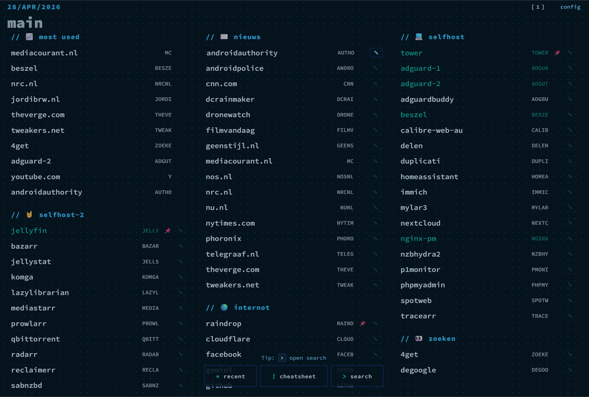
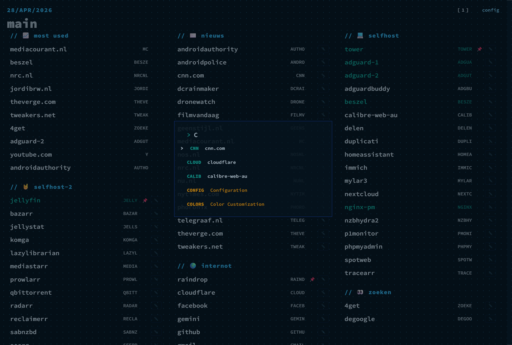
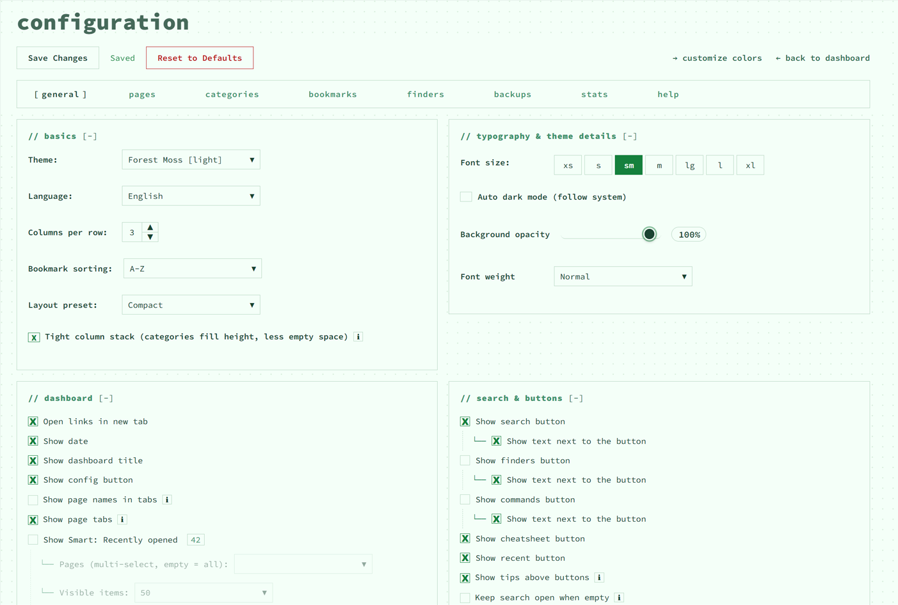
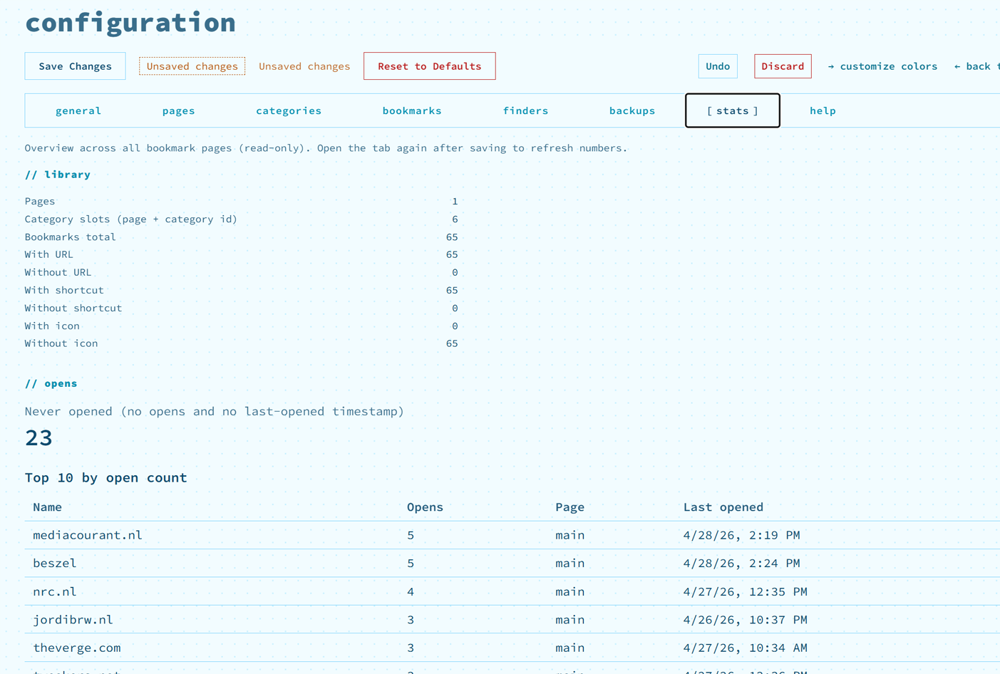

# 🚀 nextDash

**A lightweight, self-hosted bookmark dashboard for power users.**
Featuring a minimalist, keyboard-first interface with extensive customization options. Based on ThinkDashboard by MatiasDesuu.

---

## ✨ Core Features

### ⌨️ Power User Workflow
- **Keyboard-Driven**: Navigate, switch pages, and open bookmarks entirely from the keyboard.
- **Fuzzy Search**: Press `/` to quickly search all bookmarks with fuzzy matching.
- **External Finders**: Use `?` followed by a shortcut (e.g., `?g`) to run searches on external engines.
- **Command System**: Manage settings via the command bar with commands like `:theme`, `:layout`, or `:density`.

### 🎨 Customization & Design
- **Layout Presets**: Choose from multiple styles such as Default, Compact, Cards, Terminal-ish, Masonry, or Detailed List.
- **Theme Engine**: 32+ built-in theme families, automatic Dark Mode, and an editor for custom themes.
- **UI Tweaks**: Customize everything from column widths (1–6) and fonts to background transparency and animations.
- **Responsive & PWA**: Works on desktop, tablet and mobile. Installable as a PWA with optional HyprMode support.

### 📊 Intelligence & Monitoring
- **Smart Collections**: Dynamic sections for Recently Opened, Most Used and Stale Bookmarks (links you haven't used recently).
- **Status Monitoring**: Real-time online/offline detection for services, including basic ping timings.
- **Metadata Extraction**: Automatically fetches page titles, descriptions and previews for added URLs.
- **Organization**: Manage unlimited pages and organize bookmarks into collapsible categories.

---

## 🖼️ Screenshots

|  |  |
|:---:|:---:|
|  |  |

---

## 🛠 Recent Improvements
- **Interactive Onboarding**: A guided setup for new installations (language, weather, layout, search tips, keyboard and mouse bookmark usage, then finish).
- **Tight Column Stacking**: Optimizes the layout on wide screens to reduce vertical whitespace.
- **Advanced Asset Management**: Upload custom icons, fonts and favicons directly from the settings panel.
- **Validation Guardrails**: Built-in detection for duplicate shortcuts and URL conflicts.
- **Sync & Undo**: Real-time sync between tabs and undo toasts for destructive actions.

---

## 🚀 Quick Start

### Using Docker Compose (Recommended)
```yaml
services:
  nextDash:
    image: ghcr.io/jordibrouwer/nextDash:latest
    container_name: nextDash
    ports:
      - "8080:8080"
    volumes:
      - ./data:/app/data
    environment:
      - PORT=8080
    restart: unless-stopped
```

Run with:

```sh
docker-compose up -d
```

Or build and run locally with Go:

```sh
go build -o nextDash && ./nextDash
```

---

## 🧩 Browser Extension

This repository also includes the **nextDash Bookmark Saver** browser extension (`extension/`), which lets you save the current tab directly to a nextDash page.

### Install (Chrome / Chromium)
1. Open `chrome://extensions/`
2. Enable **Developer mode** (top right)
3. Click **Load unpacked**
4. Select the `extension` folder from this repository

### First-time setup
1. Click the extension icon
2. Open the **Settings** tab
3. Set your nextDash server URL (for example `http://localhost:8080`)
4. Choose a default page and save settings

For full extension usage and development notes, see `extension/README.md`.

---

## Contributing

Contributions are welcome. Please open issues or pull requests for bugs, features or translations.

---

## License

This project is released under the MIT License.
