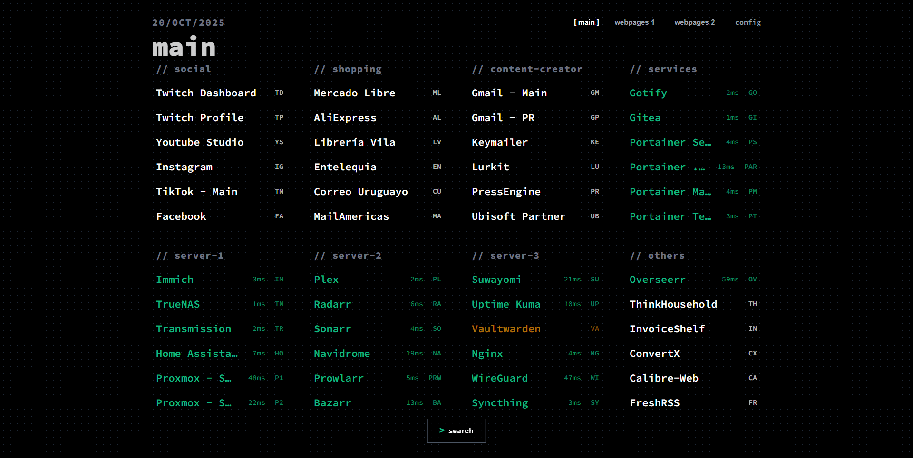
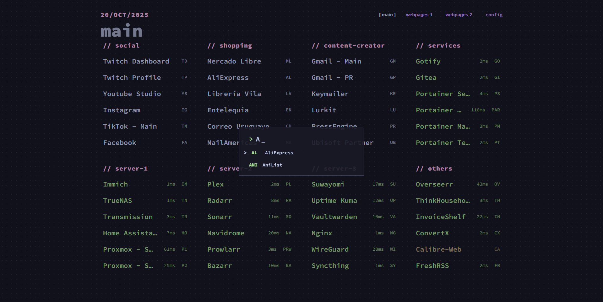
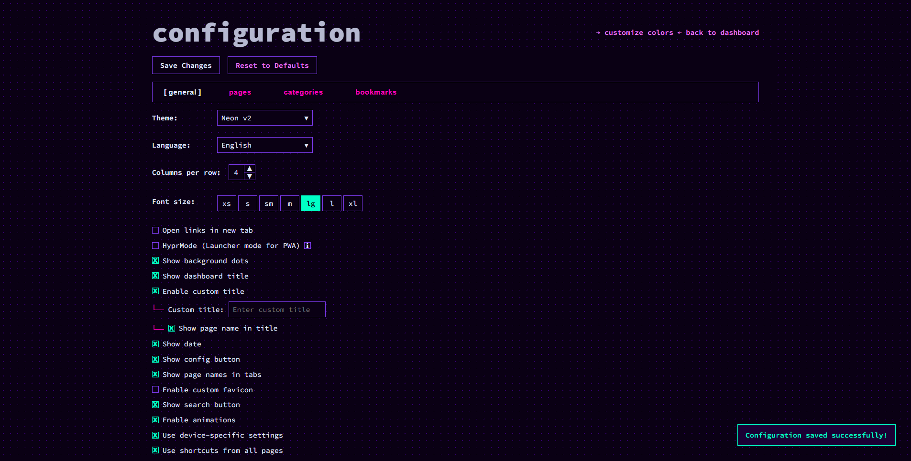
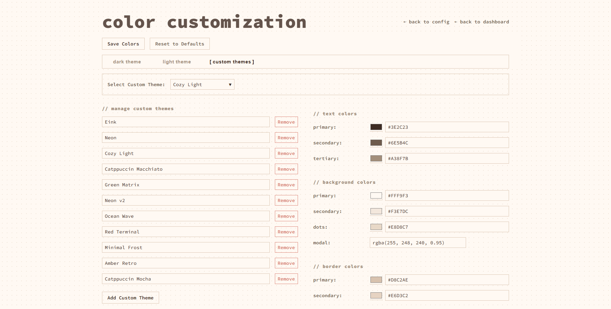
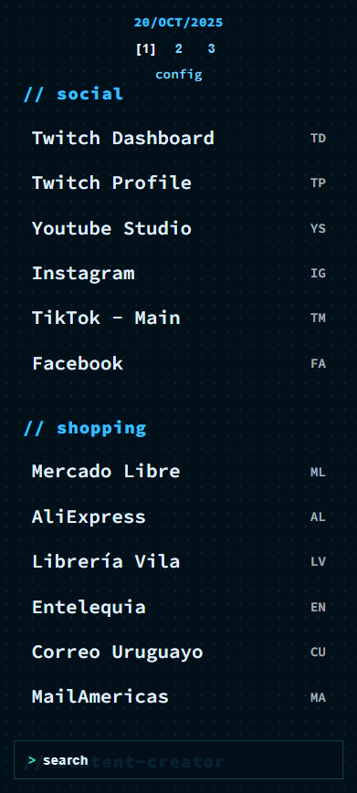
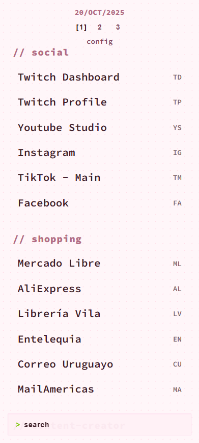

# nextDash

A lightweight, self-hosted bookmark dashboard built with Go and vanilla JavaScript. Features a minimalist, keyboard-driven interface with extensive customization options, making it the perfect personal dashboard for power users.

## ✨ Core Features

- **Minimalist Design**: Clean, text-based interface optimized for speed and simplicity
- **Keyboard-Driven**: Navigate and open bookmarks entirely with the keyboard
- **Highly Customizable**: Colors, layouts, fonts, and extensive configuration options
- **Multiple Pages**: Create and manage multiple dashboard pages
- **Categories**: Organize bookmarks into collapsible categories
- **Responsive Design**: Works seamlessly on desktop, tablet, and mobile devices
- **Multi-Language Support**: English and Dutch
- **Self-Hosted**: Own your data - runs locally in Docker or natively with Go
- **Progressive Web App (PWA)**: Installable as an app on desktop or mobile

## 🖼️ Screenshots

|  |  |
|--------------------------|--------------------------|
|  |  |

<p align="center">
  📱Mobile view<br>
  
  
</p>

## 🎯 Complete Feature List

### Search & Lookup
- **Bookmark Shortcuts** - Type any assigned shortcut (e.g., "yt") to open bookmarks
- **Fuzzy Search** - Press `/` to search bookmarks by name with fuzzy matching
- **Finder Search** - Press `?` followed by a finder shortcut to search external sites (e.g., `?g javascript` for Google)
- **Search Mode Toggle** - Switch between fuzzy-first and shortcut-first search modes
- **Fuzzy Suggestions** - Show additional bookmark suggestions during search
- **Search Index** - Optimized bookmark searching with built search index
- **Keep Search Open** - Keep search interface visible even when empty

### Page Management
- **Multiple Pages** - Create unlimited dashboard pages with custom names
- **Page Reordering** - Drag-and-drop to reorganize pages
- **Page Navigation** - Use number keys (1-9) or Shift+Arrow keys to switch pages
- **Page Switching Tabs** - Display page navigation as tabs or numbers
- **Default Page Protection** - Cannot delete the main/default page

### Bookmark Management
- **Create/Edit/Delete Bookmarks** - Full CRUD operations for bookmarks
- **Move Bookmarks** - Drag bookmarks between pages or use move dialog
- **Custom Icons** - Upload custom icons or auto-detect from website favicon
- **Pin Bookmarks** - Pin important bookmarks to prioritize their position
- **Open in New Tab** - Option to open links in new or current tab
- **Bookmark Metadata** - Extract title, description, and preview image from URLs
- **Drag & Drop** - Easily reorder bookmarks within categories

### Categories
- **Create/Edit/Delete Categories** - Organize bookmarks into categories
- **Category Icons** - Add custom icons to categories
- **Collapse/Expand** - Toggle category visibility
- **Auto-Collapse** - Option to collapse all categories on page load
- **Category Reordering** - Drag-and-drop to reorder categories
- **Undo Reordering** - Undo accidental drag-drop changes

### Finder (Search Engine Shortcuts)
- **Create Finders** - Set up shortcuts for search engines (Google, YouTube, GitHub, etc.)
- **Dynamic URLs** - Use `%s` placeholder in finder URLs for search terms
- **Space-Activated** - Type finder shortcut and press space to activate finder mode
- **Include in Search** - Access finders directly from main search

### Display & Layout Options
- **Column Layout** - 1-6 columns per row, adjustable on the fly
- **Font Sizes** - 7 preset sizes (XS, S, SM, M, LG, L, XL)
- **Font Weight** - Normal, 600 (semi-bold), or Bold options
- **Custom Fonts** - Upload and use custom font files
- **Light/Dark Themes** - Toggle between light and dark themes
- **Auto Dark Mode** - Automatically follow system dark mode preference
- **Background Dots** - Animated background dots (toggle on/off)
- **Background Opacity** - Slider control for background transparency
- **Layout Presets** - Default, Compact, Cards, and Terminal-ish layouts

### Theme & Color Customization
- **Default Themes** - Pre-configured light and dark themes
- **Unlimited Custom Themes** - Create and save unlimited theme variants
- **Color Picker** - Customize individual colors:
  - Text colors (primary, secondary, tertiary)
  - Background colors
  - Border colors
  - Accent colors (success, warning, error)
- **Live Preview** - See color changes in real-time before saving
- **Reset to Defaults** - Restore default colors with one click

### Keyboard Navigation
- **Type to Open** - Press any letter to search/open bookmarks
- **Arrow Keys** - Navigate between bookmarks with arrow keys
- **Enter/Space to Open** - Open selected bookmark
- **Help Overlay** - Press `h` to see all keyboard shortcuts
- **Page Navigation Keys** - Number keys for page switching
- **Tab Navigation** - Full keyboard accessibility

### Touch & Mobile
- **Responsive Layout** - Automatically adapts to screen size
- **Swipe Navigation** - Swipe left/right to change pages
- **Touch-Friendly** - Optimized touch targets and interactions
- **Mobile Viewport** - Proper viewport settings for mobile devices

### Command System
- **Theme Command** - `:theme` to switch themes
- **Columns Command** - `:columns` to change column count
- **Font Size Command** - `:fontsize` to adjust font size
- **Command Button** - Access all commands from UI
- **Command Autocomplete** - Search/filter available commands

### Status Monitoring
- **Online/Offline Detection** - Check if bookmarked URLs are accessible
- **Ping Times** - Display response time in milliseconds
- **Status Indicators** - Visual indicator for each bookmark
- **Loading Animation** - Show progress during status check
- **Skip Fast Ping Option** - Option to skip TCP check, only HTTP request
- **Toggle Status Display** - Show/hide status indicators globally

### Backup & Import/Export
- **Create Backup** - Export complete dashboard as ZIP file
- **Backup Contents**:
  - All bookmarks and pages
  - All categories
  - All settings and preferences
  - All custom themes
  - Favicon, fonts, and custom icons
- **Import Backup** - Restore from previously exported ZIP
- **Import Confirmation** - Confirmation dialog to prevent accidental overwrites
- **Data Reset** - Reset all data to defaults

### Configuration Management
- **General Settings** - Theme, language, columns, font size, etc.
- **Dashboard Settings** - Title, date display, button visibility
- **Advanced Settings** - Animations, custom favicon, custom font
- **Device-Specific Settings** - Save settings locally to device/browser
- **Global Settings** - Save settings to server
- **Auto-Save** - Settings automatically saved on change
- **Settings Reset** - Reset all settings with confirmation

### UI Customization
- **Toggle Config Button** - Show/hide config access
- **Toggle Search Button** - Show/hide search access
- **Toggle Finders Button** - Show/hide finders access
- **Toggle Commands Button** - Show/hide commands access
- **Toggle Button Text** - Show/hide text labels on buttons
- **Toggle Dashboard Title** - Show/hide page title
- **Toggle Date Display** - Show/hide current date
- **Toggle Page Tabs** - Show/hide page navigation
- **Toggle Bookmark Icons** - Show/hide icons on bookmarks
- **Toggle Status Indicators** - Show/hide online/offline status
- **Toggle Ping Times** - Show/hide response times
- **Toggle Status Loading** - Show/hide loading animation

### PWA & Launcher
- **Progressive Web App** - Installable as standalone app
- **HyprMode** - Launcher mode that closes PWA window after opening bookmark
- **Web App Manifest** - Full PWA support with manifest
- **Chrome Extension** - Browser extension for quick bookmark addition from any webpage

### Browser & Storage
- **Custom Page Title** - Set custom browser tab title
- **Show Page in Title** - Display current page name in browser title
- **Multi-Language**: English and Dutch translations
- **JSON Data Storage** - All data stored as JSON in `/data` directory:
  - `bookmarks-X.json` - Per-page bookmarks
  - `colors.json` - Theme colors and custom themes
  - `pages.json` - Page order
  - `settings.json` - Application settings

### Analytics & Tracking
- **Open Count** - Track how many times each bookmark is opened
- **Last Opened Time** - See when bookmarks were last accessed
- **Duplicate Detection** - Find duplicate bookmarks
- **Bookmark Preview** - Extract and display metadata from bookmarks

### Sorting & Organization
- **Manual Ordering** - Drag-and-drop to arrange bookmarks
- **Alphabetical Sorting** - Sort bookmarks A-Z
- **Recently Used** - Sort by last opened time
- **Pinned First** - Custom pinned priority sorting
- **Undo Reorder** - Undo drag-drop changes

## 🚀 Quick Start

### Using Docker Compose (Recommended)

```yaml
services:
  nextDash:
    image: ghcr.io/jordibrouwer/nextDash:latest
    container_name: nextDash
    ports:
      - "8080:8080"
    volumes:
      - ./data:/app/data
    environment:
      - PORT=8080
    restart: unless-stopped
```

1. Save the above as `docker-compose.yml`
2. Run: `docker-compose up -d`
3. Open: `http://localhost:8080`

### Using Docker

```bash
docker run --name nextDash -d -p 8080:8080 -v ./data:/app/data -e PORT=8080 --restart unless-stopped ghcr.io/jordibrouwer/nextDash:latest
```

Then open `http://localhost:8080`

### Using Go (Development)

1. Clone the repository:
```bash
git clone https://github.com/jordibrouwer/nextDash.git
cd nextDash
```

2. Install dependencies:
```bash
go mod tidy
```

3. Run the application:
```bash
go run .
```

4. Open: `http://localhost:8080`

## 📖 Usage Guide

### Dashboard Navigation
- **Press any letter** to search/open bookmarks
- **Press `/`** to open fuzzy search
- **Press `?`** followed by a finder shortcut to search external sites
- **Press `h`** to view all keyboard shortcuts
- **Press number keys** (1-9) to switch pages
- **Use arrow keys** to navigate bookmarks

### Configuration
Access the configuration page by:
- Clicking the **"Config"** button in the top-right
- Navigating to `/config`
- Typing `:config` in the command bar

### Color Customization
Access the color customization page by:
- Clicking **"Customize Colors"** in the config page
- Navigating to `/colors`
- Typing `:colors` in the command bar

### Keyboard Shortcuts Reference
| Action | Shortcut |
|--------|----------|
| Search Bookmarks | Type shortcut |
| Fuzzy Search | `/` |
| Finder Search | `?` + shortcut |
| Help | `h` |
| Page 1-9 | `1-9` |
| Next Page | `Shift + Right Arrow` |
| Previous Page | `Shift + Left Arrow` |
| Navigate Bookmarks | Arrow Keys |
| Open Bookmark | `Enter` or `Space` |
| Swipe (Mobile) | Left/Right swipe |

## 💾 Data Storage

All data is stored in JSON files in the `data/` directory:

| File | Purpose |
|------|---------|
| `bookmarks-1.json`, `bookmarks-2.json`, etc. | Bookmarks for each page |
| `pages.json` | Page names and order |
| `categories.json` | Category configuration |
| `finders.json` | Finder search engine definitions |
| `settings.json` | Application settings |
| `colors.json` | Theme colors and custom themes |

### Backup & Restore
- **Create Backup**: Use the "Backup" option in config to export as ZIP
- **Restore**: Use the "Import" option to restore from previously exported ZIP
- The backup includes all bookmarks, settings, themes, and uploaded files

## 🌐 Browser Compatibility

- **Chrome/Chromium**: Full support
- **Firefox**: Full support
- **Safari**: Full support
- **Edge**: Full support
- **Mobile browsers**: Full responsive support

## 📱 Mobile App

nextDash can be installed as a PWA on:
- iOS Safari
- Android Chrome
- Desktop (Chrome, Edge)

**Installation**:
1. Open nextDash in your browser
2. Click the "Install" button (or use browser menu → "Install app")
3. Grant permissions
4. Access from your home screen or app drawer

### HyprMode (Launcher)
Enable HyprMode in settings when using as PWA. This will:
- Open bookmarks in a new browser tab
- Automatically close the PWA window
- Mimic traditional app launcher behavior

## 🔌 Chrome Extension

A Chrome extension is included for quick bookmark saving:

1. Open the `extension/` folder in the repository
2. Go to `chrome://extensions/`
3. Enable **Developer mode**
4. Click **Load unpacked**
5. Select the `extension/` folder

**Usage**:
- Click the extension icon on any webpage
- Edit the bookmark name/URL/category if needed
- Click **Save Bookmark** to add to your dashboard

## ⚙️ API Endpoints

nextDash provides a RESTful API:

### Bookmarks
- `GET /api/bookmarks/{page}` - Get bookmarks for a page
- `POST /api/bookmarks/{page}` - Create bookmark
- `PUT /api/bookmarks/{page}/{id}` - Update bookmark
- `DELETE /api/bookmarks/{page}/{id}` - Delete bookmark

### Pages
- `GET /api/pages` - Get all pages
- `POST /api/pages` - Create page
- `PUT /api/pages/{id}` - Update page
- `DELETE /api/pages/{id}` - Delete page

### Other Endpoints
- `GET /api/settings` - Get application settings
- `PUT /api/settings` - Update settings
- `GET /api/colors` - Get theme colors
- `PUT /api/colors` - Update colors
- `GET /api/ping?url=...` - Check if URL is online
- `GET /health` - Health check endpoint

## 🌍 Languages Supported

- 🇬🇧 English
- �🇱 Dutch

Switch languages in **Config → General Settings → Language**

## 🛠️ Configuration Options

### General Settings
- Theme (Light, Dark, Auto)
- Language
- Columns (1-6)
- Font Size (XS, S, SM, M, LG, L, XL)
- Font Weight
- Layout Preset
- Custom Font Upload
- Custom Favicon Upload

### Dashboard Settings
- Custom page title
- Show/hide page title
- Show/hide date
- Show/hide page tabs
- Show/hide bookmark icons
- Show/hide status indicators
- Show/hide ping times

### Advanced Settings
- Auto dark mode
- Background dots
- Background opacity
- Enable animations
- Device-specific settings
- Global settings
- Status checking interval
- Skip fast ping

### Button Visibility
- Show/hide Config button
- Show/hide Search button
- Show/hide Finders button
- Show/hide Commands button
- Show/hide button text labels

## 🔒 Data Privacy

- **Self-hosted**: All data stays on your server
- **No tracking**: No analytics or telemetry
- **No cloud**: No automatic backups to cloud services
- **Local storage**: Optional device-specific settings stored locally in browser
- **Backup control**: You control when and where backups are created

## 📋 License

This project is licensed under the MIT License - see the LICENSE file for details.
